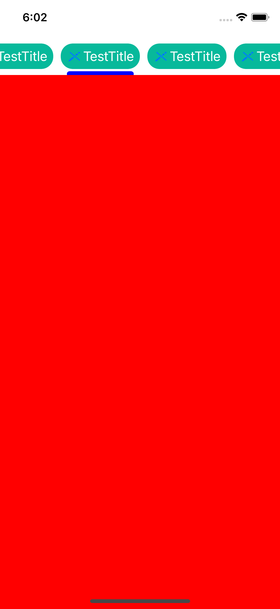

# RKPagerTabBar

<p align="center">

</p>

## Usage

```swift

import UIKit
import RKPagerTabBarSwift

class ViewController: ButtonBarPagerTabStripViewController {
    
    var collectionView = ButtonBarView(frame: .zero, collectionViewLayout: UICollectionViewFlowLayout())
    var scrollView = UIScrollView()
    
    override func loadView() {
        super.loadView()
        setup()
    }
    
    private func setup() {
        // MARK: -Connect to parent controller properties
        containerView = scrollView
        buttonBarView = collectionView
        
        // MARK: -Add views & set constraints
        view.addSubview(collectionView)
        collectionView.translatesAutoresizingMaskIntoConstraints = false
        NSLayoutConstraint.activate([
            collectionView.topAnchor.constraint(equalTo: view.layoutMarginsGuide.topAnchor),
            collectionView.leadingAnchor.constraint(equalTo: view.leadingAnchor),
            collectionView.trailingAnchor.constraint(equalTo: view.trailingAnchor),
            collectionView.heightAnchor.constraint(equalToConstant: 50)
        ])
        
        view.addSubview(scrollView)
        scrollView.translatesAutoresizingMaskIntoConstraints = false
        NSLayoutConstraint.activate([
            scrollView.topAnchor.constraint(equalTo: collectionView.bottomAnchor),
            scrollView.leadingAnchor.constraint(equalTo: view.leadingAnchor),
            scrollView.trailingAnchor.constraint(equalTo: view.trailingAnchor),
            scrollView.bottomAnchor.constraint(equalTo: view.bottomAnchor)
        ])
        
        // MARK: -Customization for cells
        changeCurrentIndexProgressive = { oldCell, newCell, progressPercentage, changeCurrentIndex, animated in
            
            oldCell?.layer.cornerRadius = 16
            newCell?.layer.cornerRadius = 16
        }
        
    }
    
    override func viewDidLoad() {
        collectionView.selectedBarInset = 8
        collectionView.selectedBar.layer.cornerRadius = 4
        collectionView.selectedBar.layer.maskedCorners = [.layerMinXMinYCorner, .layerMaxXMinYCorner]
        settings.style.insetCells = 16
        settings.style.buttonBarBackgroundColor = .white
        settings.style.buttonBarLeftContentInset = 8
        settings.style.buttonBarRightContentInset = 8
        settings.style.selectedBarBackgroundColor = .blue
        // MARK: -Add your customization before super.viewDidLoad()
        super.viewDidLoad()
    }
    // MARK: -Add your controllers
    override func viewControllers(for pagerTabStripController: PagerTabStripViewController) -> [UIViewController] {
        [
            TestViewController(),
            TestViewController(),
            TestViewController(),
            TestViewController(),
            TestViewController()
        ]
    }
}


// MARK: -Conform to IndicatorInfoProvider for children view controllers
class TestViewController: UIViewController, IndicatorInfoProvider {
    
    func indicatorInfo(for pagerTabStripController: PagerTabStripViewController) -> IndicatorInfo {
        IndicatorInfo(title: "TestTitle", image: .init(systemName: "pencil.slash"), imageScale: 20)
    }
    
    override func viewDidLoad() {
        super.viewDidLoad()
        view.backgroundColor = .red
    }
}


```


